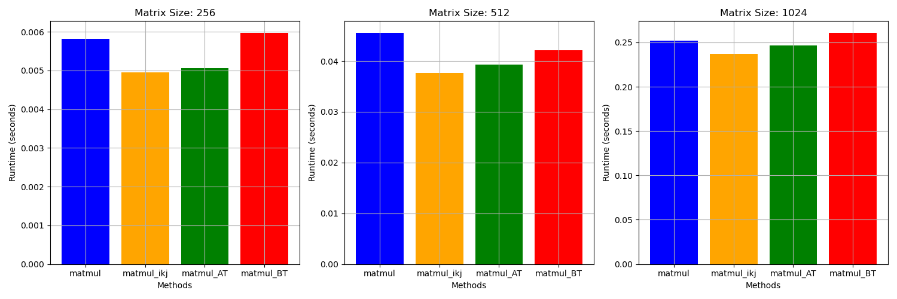
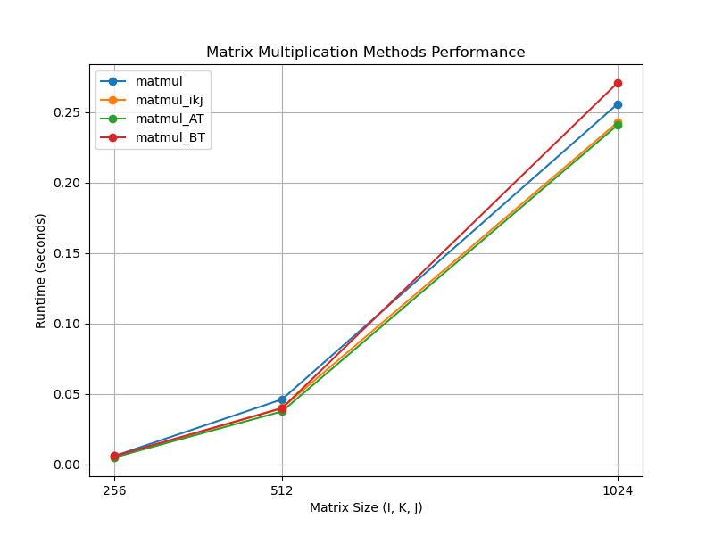
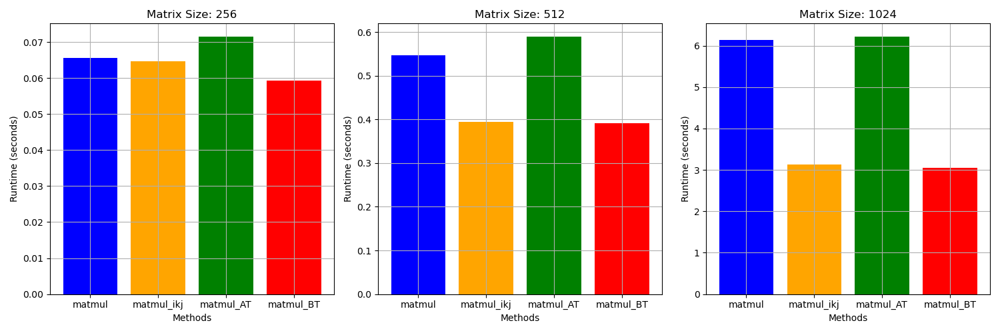
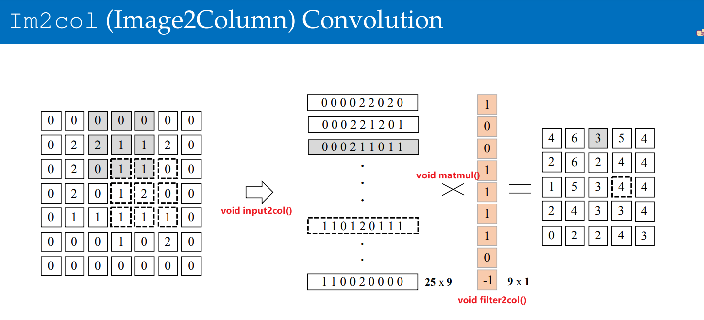
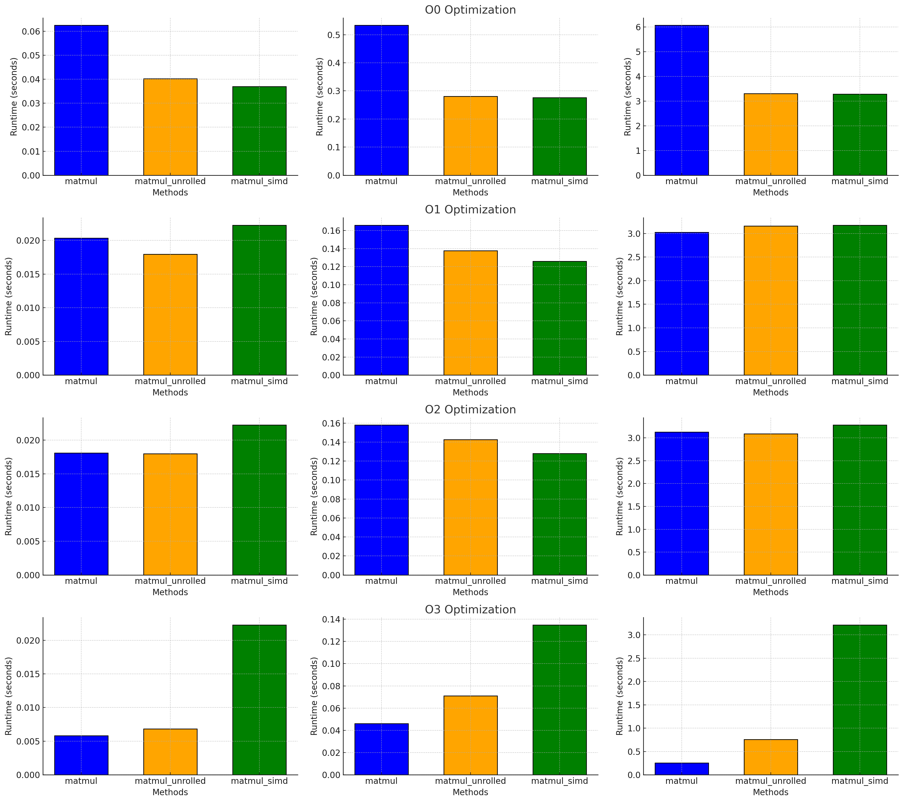

# CMSC5743 Lab 01

[TOC]

## Question 1

**Q1**: The shape of matrix A is I × K and the shape of matrix B is K × J. Please explore the different shapes of matrix A, B mentioned in matmul.cpp to get the different runtime performance under matmul(), matmul ikj(), matmul AT(), matmul BT(). The value of I, K, J will be fixed at 256,512 or 1024. You can refer to the report-format to finish your submission.

### Experiment results

| name /matrix size | 256        | 512        | 1024       |
| ----------------- | ---------- | ---------- | ---------- |
| matmul            | 0.005820 s | 0.045579 s | 0.252103 s |
| matmul_ikj        | 0.004952 s | 0.037697 s | 0.237074 s |
| matmul_AT         | 0.005057 s | 0.039343 s | 0.246345 s |
| matmul_BT         | 0.005975 s | 0.042132 s | 0.260963 s |

### Summary





### Analyze

The access method of 3 matrix in different matrix multiplication strategy:

| name / matrix | A (read)    | B (read)    | C (write) | performance |
| ------------- | ----------- | ----------- | --------- | ----------- |
| matmul        | row-base    | column-base | row-base  | 3rd         |
| matmul_ikj    | row-base    | row-base    | row-base  | 1st         |
| matmul_AT     | column-base | column-base | row-base  | 2nd         |
| matmul_BT     | row-base    | row-base    | row-base  | 4th         |

why `matmul_ikj` is better than `matmul_BT`?

why `matmul_AT` is good(close to `matmul_ikj`)?

😥

> ```
> # g++ version
> Using built-in specs.
> COLLECT_GCC=g++
> COLLECT_LTO_WRAPPER=/usr/lib/gcc/x86_64-linux-gnu/9/lto-wrapper
> OFFLOAD_TARGET_NAMES=nvptx-none:hsa
> OFFLOAD_TARGET_DEFAULT=1
> Target: x86_64-linux-gnu
> Configured with: ../src/configure -v --with-pkgversion='Ubuntu 9.4.0-1ubuntu1~20.04.2' --with-bugurl=file:///usr/share/doc/gcc-9/README.Bugs --enable-languages=c,ada,c++,go,brig,d,fortran,objc,obj-c++,gm2 --prefix=/usr --with-gcc-major-version-only --program-suffix=-9 --program-prefix=x86_64-linux-gnu- --enable-shared --enable-linker-build-id --libexecdir=/usr/lib --without-included-gettext --enable-threads=posix --libdir=/usr/lib --enable-nls --enable-clocale=gnu --enable-libstdcxx-debug --enable-libstdcxx-time=yes --with-default-libstdcxx-abi=new --enable-gnu-unique-object --disable-vtable-verify --enable-plugin --enable-default-pie --with-system-zlib --with-target-system-zlib=auto --enable-objc-gc=auto --enable-multiarch --disable-werror --with-arch-32=i686 --with-abi=m64 --with-multilib-list=m32,m64,mx32 --enable-multilib --with-tune=generic --enable-offload-targets=nvptx-none=/build/gcc-9-9QDOt0/gcc-9-9.4.0/debian/tmp-nvptx/usr,hsa --without-cuda-driver --enable-checking=release --build=x86_64-linux-gnu --host=x86_64-linux-gnu --target=x86_64-linux-gnu
> Thread model: posix
> gcc version 9.4.0 (Ubuntu 9.4.0-1ubuntu1~20.04.2) 
> ```
>
> compile command
>
> ```
> g++ matmul.cpp -o matmul -std=c++17 -O3 -Wall && ./matmul
> ```

### Futher analyze

I noticed that the original `run_matmul.sh` script was using the **`-O3` optimization level**. To ensure that no compiler optimizations interfere with the behavior of the code in ways I might not anticipate, I decided to **modify the optimization level to `-O0`** and rerun the experiment.

```shell
# original run_matmul.sh
g++ matmul.cpp -o matmul -std=c++17 -O3 -Wall && ./matmul
rm -rf matmul
# modified
g++ matmul.cpp -o matmul -std=c++17 -O0 -Wall && ./matmul
rm -rf matmul
```

### Experiment 2 results

| name /matrix size | 256        | 512        | 1024       |
| ----------------- | ---------- | ---------- | ---------- |
| matmul            | 0.065569 s | 0.546643 s | 6.135536 s |
| matmul_ikj        | 0.064645 s | 0.394753 s | 3.125915 s |
| matmul_AT         | 0.071563 s | 0.590205 s | 6.224071 s |
| matmul_BT         | 0.059273 s | 0.391127 s | 3.047686 s |

### Summary



| name / matrix | A (read)    | B (read)    | C (write) | performance |
| ------------- | ----------- | ----------- | --------- | ----------- |
| matmul        | row-base    | column-base | row-base  | 3rd         |
| matmul_ikj    | row-base    | row-base    | row-base  | 2nd         |
| matmul_AT     | column-base | column-base | row-base  | 4th         |
| matmul_BT     | row-base    | row-base    | row-base  | 1st         |

### Analyze

In modern computer systems, memory access is much slower than CPU computation, making efficient memory usage crucial for performance. Data is stored in memory in a row-major order, where consecutive addresses contain elements from the same row. Row-wise access, as in `matmul_ikj()` and `matmul_BT`, leverages **spatial locality**, allowing cache lines to load adjacent data, which increases the **cache hit rate** and reduces costly memory accesses. In contrast, the naive `matmul` and `matmul_AT` suffer from poor performance due to **bad memory access patterns**, leading to frequent cache misses and reduced efficiency.

However, as observed from the first experiment, when utilizing `O3` optimization, the performance of `matmul_AT` matches that of `matmul_ikj`, which consistently achieves a good performance. This may be attributed to a particular structure in the implementation of `matmul_AT` that favors **compiler optimizations**, allowing it to close the performance gap despite its less efficient memory access pattern.

## Question 2

**Q2**: Learn the im2col from the Useful Materials Section to implement it from scratch using C++ to optimize standard convolution operation. 

```
• batch: 1 
• height feature: 56 
• width feature: 56 
• in channels: 3 
• out channels: 64 
• kernel size: 3 
• stride: 1 
• padding: 0
```



### Code

```c++
void input2col(); // The input2col function that will convert the input feature map to column format
void filter2col(); // The filter2col function that will convert the filters to column format
void matmul() ;// Matrix multiplication to calculate the output feature map
void naive_conv2d();// Naive 2D convolution implementation

void im2col(){
    input2col();
    filter2col();
    matmul();
}
```

the `col2im` process of output matrix is integrated in `matmul()` through index control.

```c++
 // Perform matrix multiplication
    for (int n = 0; n < batch; ++n) {
        for (int oc = 0; oc < output_channels; ++oc) {
            for (int i = 0; i < output_H * output_W; ++i) { // Iterate over output feature map positions
                for (int j = 0; j < input_channels * kernel_size * kernel_size; ++j) { // Iterate over filter_col and im_col
                    output_feature_map[n][oc][i / output_W][i % output_W] += 
                        filter_col[oc][j] * im_col[n][j][i]; //perform output column to matrix by using index `i / output_W` and `i % output_W`
                }
            }
        }
    }
```

 

### Performance

| im2col      | naive_conv2d | compiler optimization |
| ----------- | ------------ | --------------------- |
| 0.00356808  | 0.0037315    | O0                    |
| 0.000478044 | 0.000726737  | O1                    |
| 0.000325091 | 0.000545107  | O2                    |
| 0.000173129 | 0.000218444  | O3                    |

Here is the complete [code](./code/conv.cpp) and [running script](./code/run_conv.sh).

## Question 3

**Q3**: Based on the findings obtained in Q1, explore different techniques for cache optimization. For instance, the writing operation of matrix C is not consistent, and how to improve the write caching? Try at least two different optimization techniques to improve the cache hit ratio and reduce the matrix multiply time consumption. Here are some examples you may use:

### Loop unrolling

```c++
// matrix multiplication with loop unrolling
void matmul_unrolled() {
    memset(C, 0, sizeof(C));
    for (int i = 0; i < n; i++) {
        for (int j = 0; j < n; j++) {
            int sum0 = 0, sum1 = 0, sum2 = 0, sum3 = 0;
            int sum4 = 0, sum5 = 0, sum6 = 0, sum7 = 0;
            for (int k = 0; k < n; k += 8) {
                sum0 += A[i][k] * B[k][j];
                sum1 += A[i][k + 1] * B[k + 1][j];
                sum2 += A[i][k + 2] * B[k + 2][j];
                sum3 += A[i][k + 3] * B[k + 3][j];
                sum4 += A[i][k + 4] * B[k + 4][j];
                sum5 += A[i][k + 5] * B[k + 5][j];
                sum6 += A[i][k + 6] * B[k + 6][j];
                sum7 += A[i][k + 7] * B[k + 7][j];
            }
            C[i][j] = sum0 + sum1 + sum2 + sum3 + sum4 + sum5 + sum6 + sum7;
        }
    }
}
```

### Vectorization (SIMD)

```c++
void matmul_simd() {
    memset(C, 0, sizeof(C));
    for (int i = 0; i < n; i++) {
        for (int j = 0; j < n; j++) {
            __m256i c_vec = _mm256_setzero_si256();          
            for (int k = 0; k < n; k += 8) {
                __m256i a_vec = _mm256_loadu_si256((__m256i*)&A[i][k]);
                __m256i b_vec = _mm256_set_epi32(
                    B[k+7][j], B[k+6][j], B[k+5][j], B[k+4][j], 
                    B[k+3][j], B[k+2][j], B[k+1][j], B[k][j]);
                // Perform vectorized multiplication and accumulate into c_vec
                __m256i mul_vec = _mm256_mullo_epi32(a_vec, b_vec);  
                c_vec = _mm256_add_epi32(c_vec, mul_vec);  
            }
//Sum up the results in the SIMD register c_vec and store them back into C[i][j]
            int temp[8];
            _mm256_storeu_si256((__m256i*)temp, c_vec);
            C[i][j] = temp[0] + temp[1] + temp[2] + temp[3] + temp[4] + temp[5] + temp[6] + temp[7];
        }
    }
}

```

### Performance

| name/matrix size | 256      | 512      | 1024     | compiler optimization |
| ---------------- | -------- | -------- | -------- | --------------------- |
| matmul           | 0.062486 | 0.533476 | 6.072068 | O0                    |
| matmul_unrolled  | 0.040204 | 0.280563 | 3.308924 | O0                    |
| matmul_simd      | 0.036931 | 0.276264 | 3.289734 | O0                    |
| matmul           | 0.020365 | 0.165861 | 3.026205 | O1                    |
| matmul_unrolled  | 0.017952 | 0.137720 | 3.159662 | O1                    |
| matmul_simd      | 0.022271 | 0.126048 | 3.175285 | O1                    |
| matmul           | 0.018086 | 0.157981 | 3.130562 | O2                    |
| matmul_unrolled  | 0.017981 | 0.142533 | 3.089540 | O2                    |
| matmul_simd      | 0.022244 | 0.128161 | 3.281242 | O2                    |
| matmul           | 0.005820 | 0.046075 | 0.256784 | O3                    |
| matmul_unrolled  | 0.006834 | 0.071035 | 0.760463 | O3                    |
| matmul_simd      | 0.022283 | 0.134812 | 3.213914 | O3                    |



### Analyze

As observed from the figure, when the optimization level is set to a lower level (O0), the explicitly optimized matrix multiplication implementations (matmul_unrolled and matmul_simd) outperform the naive version. However, **as the optimization level increases, the performance of the naive matmul implementation becomes comparable to, or even better than, the matmul_unrolled and matmul_simd versions.** To investigate the cause, a parameter was added to the compile command to check the optimizations applied at the O3 level:

```shell
g++ matmul.cpp -o matmul -std=c++17 -fopt-info-optimized -O3 -Wall && ./matmul
```

The output revealed optimizations such as:

```shell
matmul.cpp:48:9: optimized:   Inlining void* memset(void*, int, size_t)/1182 into void matmul()/6468 (always_inline).
......
matmul.cpp:155:11: optimized:  Inlined void matmul()/7112 into int main()/6474 which now has time 281647601.000000 and size 80, net change of +18.
# matmul: line 47 ~ 56
matmul.cpp:49:21: optimized: loops interchanged in loop nest
matmul.cpp:51:25: optimized: loop vectorized using 32 byte vectors
......
```

These findings suggest that the naive matmul implementation outperforms both the loop unrolling and vectorized versions because **the compiler automatically applies significant optimizations**, such as loop interchange and vectorization, even though the naive code itself does not contain explicit optimizations.

## Complete code

### Question 2

- [code](./code/conv.cpp)
- [script](./code/run_conv.sh)

### Question 3

- [code](./code/matmul.cpp)
- [script](./code/run_matmul.cpp)
