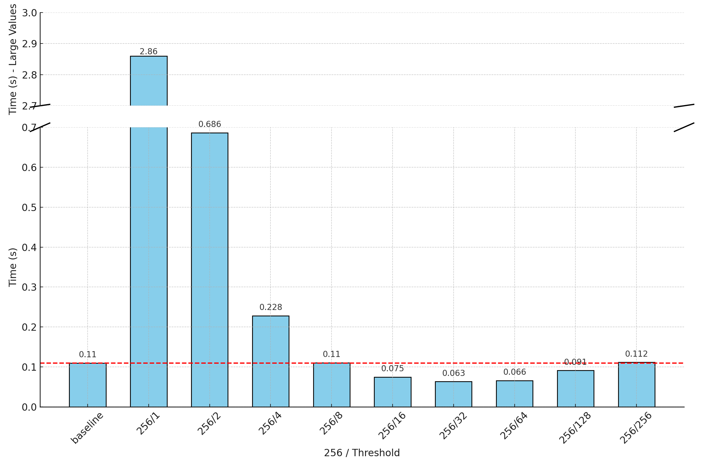

# CMSC5743 Lab 2

[TOC]

## Question 1

**Q1** Implement the matrix multiplication using Strassen Algorithm and compare the speed with original matmul() in lab 01. The shape of matrix A is I × K and the shape of matrix B is K × J. The matrix size setting remains the same as lab 01, the value of I, K, J will be fixed at 256, 512 or 1024. 

### Implement Strassen algorithm according to slide

```c++
#define I 256
#define J 512
#define K 1024

vector<vector<int>>Strassen(const vector<vector<int>>& X, const vector<vector<int>>& Y) {
	int xRow = X.size(), xCol = X[0].size(), yRow = Y.size(), yCol = Y[0].size();
	if (xRow == 1) {
		return matrixMultiply(X, Y);
	}
	else {
		// X -> 4 parts
		vector<vector<int>>X00(xRow / 2, vector<int>(xCol / 2, 0));
		vector<vector<int>>X01(xRow / 2, vector<int>(xCol / 2, 0));
		vector<vector<int>>X10(xRow / 2, vector<int>(xCol / 2, 0));
		vector<vector<int>>X11(xRow / 2, vector<int>(xCol / 2, 0));
		for (int i = 0; i < xRow / 2; i++) {
			for (int j = 0; j < xCol / 2; j++) {
				X00[i][j] = X[i][j];
				X01[i][j] = X[i][j + xCol / 2];
				X10[i][j] = X[i + xRow / 2][j];
				X11[i][j] = X[i + xRow / 2][j + xCol / 2];
			}
		}

		// Y -> 4 parts
		vector<vector<int>>Y00(yRow / 2, vector<int>(yCol / 2, 0));
		vector<vector<int>>Y01(yRow / 2, vector<int>(yCol / 2, 0));
		vector<vector<int>>Y10(yRow / 2, vector<int>(yCol / 2, 0));
		vector<vector<int>>Y11(yRow / 2, vector<int>(yCol / 2, 0));
		for (int i = 0; i < yRow / 2; i++) {
			for (int j = 0; j < yCol / 2; j++) {
				Y00[i][j] = Y[i][j];
				Y01[i][j] = Y[i][j + yCol / 2];
				Y10[i][j] = Y[i + yRow / 2][j];
				Y11[i][j] = Y[i + yRow / 2][j + yCol / 2];
			}
		}
		//calculate
		vector<vector<int>>S1 = Strassen(matrixSubtract(X01, X11), matrixAdd(Y10, Y11));//(B-D)(G+H)
        vector<vector<int>>S2 = Strassen(matrixAdd(X00, X11), matrixAdd(Y00, Y11));//(A+D)(E+H)
        vector<vector<int>>S3 = Strassen(matrixSubtract(X00, X10), matrixAdd(Y00, Y01));//(A-C)(E+F)
        vector<vector<int>>S4 = Strassen(matrixAdd(X00, X01), Y11);//(A+B)H
        vector<vector<int>>S5 = Strassen(X00, matrixSubtract(Y01, Y11));//A(F-H)
		vector<vector<int>>S6 = Strassen(X11, matrixSubtract(Y10, Y00));//D(G-E)
		vector<vector<int>>S7 = Strassen(matrixAdd(X10, X11), Y00);//(C+D)E
		
        // C00 = S1 + S2 - S4 + S6, xRow * yCol
		vector<vector<int>>C00 = matrixAdd(S1, S2);
		C00 = matrixSubtract(C00, S4);
		C00 = matrixAdd(C00, S6);

        // C01 = S4 - S5, xRow * yCol
		vector<vector<int>>C01 = matrixAdd(S4, S5);

        // C10 = S6 + S7, xRow * yCol
		vector<vector<int>>C10 = matrixAdd(S6, S7);

        // C11 = S2 - S3 + S5 - S7, xRow * yCol
		vector<vector<int>>C11 = matrixSubtract(S2, S3);
		C11 = matrixAdd(C11, S5);
		C11 = matrixSubtract(C11, S7);

		//merge C
		vector<vector<int>>result(xRow, vector<int>(yCol, 0));
		for (int i = 0; i < xRow / 2; i++) {
			for (int j = 0; j < yCol / 2; j++) {
				result[i][j] = C00[i][j];
				result[i][j + yCol / 2] = C01[i][j];
				result[i + xRow / 2][j] = C10[i][j];
				result[i + xRow / 2][j + yCol / 2] = C11[i][j];
			}
		}
		return result;
	}
}
```

### profile and compare with native matmul

| Strassen   | Native matmul |
| ---------- | ------------- |
| 2.860322 s | 0.109753 s    |

The results come from an average of 32 runs.

### Optimization

Modify the condition for entering and handling base case.

Original:

```c++
int xRow = X.size(), xCol = X[0].size(), yRow = Y.size(), yCol = Y[0].size();
	if (xRow == 1) {
		return matrixMultiply(X, Y);
	}
```

After:

```
int xRow = X.size(), xCol = X[0].size(), yRow = Y.size(), yCol = Y[0].size();
	if (xRow == threshold) {
		return matrixMultiply(X, Y);
	}
```

Profile:

| method                     | time(s)  |
| -------------------------- | -------- |
| native matmul              | 0.109753 |
| strassen (threshold = 1)   | 2.860322 |
| strassen (threshold = 2)   | 0.686267 |
| strassen (threshold = 4)   | 0.228040 |
| strassen (threshold = 8)   | 0.110396 |
| strassen (threshold = 16)  | 0.074584 |
| strassen (threshold = 32)  | 0.063404 |
| strassen (threshold = 64)  | 0.065759 |
| strassen (threshold = 128) | 0.091154 |
| strassen (threshold = 256) | 0.111582 |

Visualization:



**Analysis:**

As threshold grows from 1 to 256(I = 256), the running time first increase and then decrease, indicating that a proper threshold can largely empower the performance of Strassen algorithm. When threshold == 256, Strassen algorithm degenerates to naive matrix multiplication.

> The basic problem is that you're recursing down to a leaf size of 1 with your strassen implementaiton. Strassen's algorithm has a better Big O complexity, but constants *do* matter in reality, which means in reality you're better off with a standard n^3 matrix multiplication for smaller problem sizes.
>
> So to greatly improve your program instead of doing:
>
> ```cpp
> if (tam == 1) {
>         C[0][0] = A[0][0] * B[0][0];
>         return;
>     }
> ```
>
> use `if (tam == LEAF_SIZE) // iterative solution here`. `LEAF_SIZE` should be a constant that you have to experimentally determine for your given architecture. Depending on the architecture it may be larger or smaller - there are architectures where the constant factors for strassen are so large that it's basically always worse than a simpler n^3 implementation for sensible matrix sizes. It all depends.
>
> Refer to: https://stackoverflow.com/questions/11495723/why-is-strassen-matrix-multiplication-so-much-slower-than-standard-matrix-multip

## Question 2

**Q2** Implement a C++ verison from scratch based on Winograd algorithm and compare the speed with your original im2col implement in lab 01. Please provide analysis on whether or not is your implementation improve the speed performance and why. The Convolution kernel and input size remain the same as lab 01:

- batch: 1 
- height feature: 56 
- width feature: 56 
- in channels: 3 
- out channels: 64 
- kernel size: 3 
- stride: 1 
- padding: 0

### Profile

| Winograd   | Im2col     |
| ---------- | ---------- |
| 0.00198472 s | 0.00163886 s |

### Implementation

**Step 1: Initialize Transformation Matrices (G, B, A) for F(2, 3)**

```c++
// Initialize transformation matrices for Winograd convolution
    float G[alpha][r] = {
        {1, 0, 0},
        {0.5f, 0.5f, 0.5f},
        {0.5f, -0.5f, 0.5f},
        {0, 0, 1}
    };
    float GT[r][alpha];
    for (int i = 0; i < alpha; i++)
        for (int j = 0; j < r; j++)
            GT[j][i] = G[i][j];

    float B[alpha][alpha] = {
        {1, 0, 0, 0},
        {0, 1, -1, 1},
        {-1, 1, 1, 0},
        {0, 0, 0, -1}
    };
    float BT[alpha][alpha];
    for (int i = 0; i < alpha; i++)
        for (int j = 0; j < alpha; j++)
            BT[j][i] = B[i][j];

    float A[alpha][m] = {
        {1, 0},
        {1, 1},
        {1, -1},
        {0, -1}
    };
    float AT[m][alpha];
    for (int i = 0; i < alpha; i++)
        for (int j = 0; j < m; j++)
            AT[j][i] = A[i][j];
```

**Step 2: Transform the Filter (Compute Matrix U)**

The filter is transformed by computing U=G⋅g⋅G^T, where g is the original filter. This transformation reduces the kernel size to fit the smaller Winograd domain, leading to fewer calculations in later steps.

```c++
// Pre-compute the transformed filter matrix U
float U[alpha][alpha][output_channels][input_channels];
for (int k = 0; k < output_channels; k++) {
    for (int c = 0; c < input_channels; c++) {
        // Copy filter values for the current output and input channel
        float g_kc[r][r];
        for (int i = 0; i < r; i++)
            for (int j = 0; j < r; j++)
                g_kc[i][j] = static_cast<float>(filter[k][c][i][j]);

        // Compute G * g_kc * G^T for the transformed filter
        float temp[alpha][r];
        for (int i = 0; i < alpha; i++) {
            for (int j = 0; j < r; j++) {
                temp[i][j] = 0.0f;
                for (int k1 = 0; k1 < r; k1++)
                    temp[i][j] += G[i][k1] * g_kc[k1][j];
            }
        }
        float u[alpha][alpha];
        for (int i = 0; i < alpha; i++) {
            for (int j = 0; j < alpha; j++) {
                u[i][j] = 0.0f;
                for (int k1 = 0; k1 < r; k1++)
                    u[i][j] += temp[i][k1] * GT[k1][j];
            }
        }

        // Store the transformed filter matrix U
        for (int xi = 0; xi < alpha; xi++)
            for (int nu = 0; nu < alpha; nu++)
                U[xi][nu][k][c] = u[xi][nu];
    }
}
```

**Step 3: Transform the Input Feature Map (Compute Matrix V)**

The input is divided into tiles, each transformed by V=BT⋅d⋅B, where ddd is the original input tile. The transformation aligns the input feature map with the Winograd domain for efficient element-wise multiplication in the next step.

```c++
float V[alpha][alpha][input_channels][P];
for (int n = 0; n < batch; n++) {
    for (int c = 0; c < input_channels; c++) {
        for (int y = 0; y < tile_h; y++) {
            for (int x = 0; x < tile_w; x++) {
                float d[alpha][alpha] = {0};  // Input tile
                for (int i = 0; i < alpha; i++) {
                    for (int j = 0; j < alpha; j++) {
                        int src_row = y * m + i;
                        int src_col = x * m + j;
                        d[i][j] = (src_row < feature_H && src_col < feature_W)
                                  ? static_cast<float>(input_feature_map[n][c][src_row][src_col])
                                  : 0.0f;
                    }
                }

                // Apply B^T * d * B
                float temp[alpha][alpha];
                for (int i = 0; i < alpha; i++)
                    for (int j = 0; j < alpha; j++) {
                        temp[i][j] = 0.0f;
                        for (int k1 = 0; k1 < alpha; k1++)
                            temp[i][j] += BT[i][k1] * d[k1][j];
                    }

                float v[alpha][alpha];
                for (int i = 0; i < alpha; i++)
                    for (int j = 0; j < alpha; j++) {
                        v[i][j] = 0.0f;
                        for (int k1 = 0; k1 < alpha; k1++)
                            v[i][j] += temp[i][k1] * B[k1][j];
                    }

                int b = n * (tile_h * tile_w) + y * tile_w + x;
                for (int xi = 0; xi < alpha; xi++)
                    for (int nu = 0; nu < alpha; nu++)
                        V[xi][nu][c][b] = v[xi][nu];
            }
        }
    }
}
```

**Step 4: Element-wise Multiplication (Compute Matrix M)**

The transformed filter U and transformed input V are combined through element-wise multiplication to produce M, which represents the convolution in the Winograd domain.

```c++
float M[alpha][alpha][output_channels][P];
for (int xi = 0; xi < alpha; xi++) {
    for (int nu = 0; nu < alpha; nu++) {
        for (int k = 0; k < output_channels; k++) {
            for (int p = 0; p < P; p++) {
                float sum = 0.0f;
                for (int c = 0; c < input_channels; c++) {
                    sum += U[xi][nu][k][c] * V[xi][nu][c][p];
                }
                M[xi][nu][k][p] = sum;
            }
        }
    }
}
```

**Step 5 Inverse Transformation (Get Final Output)**

Finally, the result matrix MMM undergoes an inverse transformation using AAA to obtain the output tiles. These tiles are then assembled into the final output feature map.

```c++
// Inverse transform of M to get the final output
memset(output_winograd, 0, sizeof(output_winograd));
for (int n = 0; n < batch; n++) {
    for (int k = 0; k < output_channels; k++) {
        for (int y = 0; y < tile_h; y++) {
            for (int x = 0; x < tile_w; x++) {
                int b = n * (tile_h * tile_w) + y * tile_w + x;

                // A^T * M * A to get output tile Y
                float temp_m[alpha][alpha];
                for (int xi = 0; xi < alpha; xi++)
                    for (int nu = 0; nu < alpha; nu++)
                        temp_m[xi][nu] = M[xi][nu][k][b];

                float temp1[m][alpha];
                for (int i = 0; i < m; i++)
                    for (int j = 0; j < alpha; j++) {
                        temp1[i][j] = 0.0f;
                        for (int k1 = 0; k1 < alpha; k1++)
                            temp1[i][j] += AT[i][k1] * temp_m[k1][j];
                    }

                float Y_tile[m][m];
                for (int i = 0; i < m; i++)
                    for (int j = 0; j < m; j++) {
                        Y_tile[i][j] = 0.0f;
                        for (int k1 = 0; k1 < alpha; k1++)
                            Y_tile[i][j] += temp1[i][k1] * A[k1][j];
                    }

                // Copy Y_tile back to the output feature map
                for (int i = 0; i < m; i++) {
                    for (int j = 0; j < m; j++) {
                        int dst_row = y * m + i;
                        int dst_col = x * m + j;
                        if (dst_row < output_H && dst_col < output_W) {
                            output_winograd[n][k][dst_row][dst_col] = static_cast<int>(round(Y_tile[i][j]));
                        }
                    }
                }
            }
        }
    }
}
```

### Analysis

The slightly lower performance observed in the Winograd implementation could be attributed to the overhead from small loop iterations and the complexity of transformations. In contrast, the im2col method's simpler operations and potential for better cache utilization might lead to improved performance under the given conditions.

(1) **Potential Overhead from Small Loop Iterations**:

The Winograd implementation includes several nested loops with small iteration counts (e.g., `alpha = 4`). When loop bodies contain minimal computations, the overhead associated with loop control structures—such as initialization, condition checking, and incrementing—can become significant relative to the computations performed. This overhead might contribute to reduced performance in the Winograd method.

```c++
// Small loops in Winograd transformations
for (int i = 0; i < alpha; i++) {
    for (int j = 0; j < alpha; j++) {
        temp[i][j] = 0.0f;
        for (int k1 = 0; k1 < alpha; k1++) {
            temp[i][j] += BT[i][k1] * d[k1][j];
        }
    }
}
```

In this snippet, the small size of `alpha` results in loops that may not perform enough computations to offset the loop overhead.

(2) **Comparison with the im2col Method**:

- **Simpler Operations**: The im2col method involves transforming the input into a matrix format and performing standard matrix multiplication. This process is relatively straightforward and involves fewer computational steps compared to the multiple transformation stages in the Winograd algorithm. The simplicity of operations in im2col might lead to better performance in certain scenarios.
- **Potential for Better Cache Utilization**: The data structures used in the im2col method often lead to sequential memory access patterns, which can enhance cache performance. Improved cache utilization may contribute to faster execution times despite the lack of advanced optimizations in the code.

```c++
// Input transformation in im2col
void input2col() {
    for (int n = 0; n < batch; ++n) {
        for (int h_out = 0; h_out < output_H; ++h_out) {
            for (int w_out = 0; w_out < output_W; ++w_out) {
                int col_index = h_out * output_W + w_out;
                for (int c = 0; c < input_channels; ++c) {
                    int channel_offset = c * kernel_size * kernel_size;
                    for (int kh = 0; kh < kernel_size; ++kh) {
                        for (int kw = 0; kw < kernel_size; ++kw) {
                            int h_in = h_out + kh;
                            int w_in = w_out + kw;
                            im_col[n][channel_offset + kh * kernel_size + kw][col_index] =
                                input_feature_map[n][c][h_in][w_in];
                        }
                    }
                }
            }
        }
    }
}
```

This code demonstrates sequential data access, which may improve memory access efficiency and cache performance.
